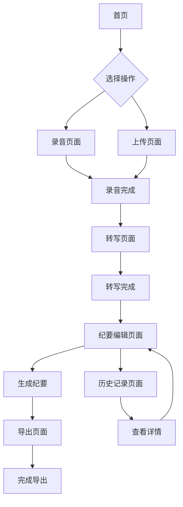

## 1. 产品概述
自动会议纪要工具是一款智能会议记录应用，通过AI技术实现录音转文字、智能提取关键信息和自动生成会议纪要。帮助用户节省手动记录时间，提高会议效率，确保重要信息不遗漏。

面向企业用户、项目经理、行政助理等需要频繁参加会议并记录纪要的人群，提供一站式智能会议记录解决方案。

## 2. 核心功能

### 2.1 用户角色
| 角色 | 注册方式 | 核心权限 |
|------|----------|----------|
| 普通用户 | 邮箱注册 | 录音、转文字、生成纪要、导出 |
| 高级用户 | 付费升级 | 无限录音时长、高级AI模板、团队协作 |

### 2.2 功能模块
产品包含以下核心页面：
1. **首页**：功能介绍、快速开始入口、历史记录概览
2. **录音页面**：实时录音、文件上传、录音管理
3. **转写页面**：语音转文字进度、文本预览、编辑功能
4. **纪要编辑页面**：智能生成纪要、手动编辑、格式化工具
5. **历史记录页面**：会议纪要列表、搜索筛选、批量操作
6. **导出页面**：格式选择、导出设置、下载管理
7. **用户中心页面**：个人信息、订阅管理、使用统计

### 2.3 页面详情
| 页面名称 | 模块名称 | 功能描述 |
|----------|----------|----------|
| 首页 | 功能介绍区 | 展示产品核心功能和优势，包含使用引导 |
| 首页 | 快速开始入口 | 提供录音和上传文件的快速入口按钮 |
| 首页 | 历史记录概览 | 显示最近5条会议纪要的缩略信息 |
| 录音页面 | 实时录音模块 | 开始/暂停/停止录音，显示录音时长和波形图 |
| 录音页面 | 文件上传模块 | 支持拖拽和选择音频文件，格式验证 |
| 录音页面 | 录音管理 | 播放预览、重命名、删除录音文件 |
| 转写页面 | 转写进度显示 | 实时显示语音转文字的处理进度 |
| 转写页面 | 文本预览编辑 | 显示转写结果，支持文本编辑和纠错 |
| 转写页面 | 说话人识别 | 自动区分不同说话人，支持手动调整 |
| 纪要编辑页面 | 智能生成模块 | 一键生成会议纪要，提取关键信息 |
| 纪要编辑页面 | 手动编辑工具 | 富文本编辑器，支持标题、列表、加粗等格式 |
| 纪要编辑页面 | 模板选择 | 提供多种会议纪要模板供选择 |
| 历史记录页面 | 会议列表 | 显示所有会议纪要，支持排序和筛选 |
| 历史记录页面 | 搜索功能 | 按标题、日期、关键词搜索会议纪要 |
| 历史记录页面 | 批量操作 | 批量删除、导出、分享会议纪要 |
| 导出页面 | 格式选择 | 支持PDF、Word、Markdown格式导出 |
| 导出页面 | 导出设置 | 自定义页眉页脚、公司Logo、字体样式 |
| 导出页面 | 下载管理 | 显示导出历史，支持重新下载 |
| 用户中心页面 | 个人信息 | 显示和编辑用户基本信息 |
| 用户中心页面 | 订阅管理 | 查看订阅状态、升级套餐、支付记录 |
| 用户中心页面 | 使用统计 | 显示录音时长、转写字数等使用数据 |

## 3. 核心流程

### 普通用户流程
用户从首页开始，可以选择直接录音或上传已有音频文件。系统会自动进行语音转文字处理，处理完成后用户可以在转写页面查看和编辑文本。确认无误后，用户可以点击生成会议纪要，系统会智能提取关键信息、行动项和决策点。生成的纪要可以在编辑页面进行手动调整和格式化，最后选择需要的格式导出。

### 历史记录管理流程
用户可以随时查看历史记录页面，浏览所有已处理的会议纪要。支持按时间、标题、关键词进行搜索筛选。可以对单条记录进行查看、编辑、导出、删除等操作，也可以进行批量操作。

## 4. 用户界面设计

### 4.1 设计风格
- **主色调**：蓝色系（#2563eb）为主，体现专业和可信赖感
- **辅助色**：灰色系（#6b7280）用于文字和边框，绿色（#10b981）用于成功状态
- **按钮样式**：圆角矩形，主要按钮使用渐变背景，次要按钮使用边框样式
- **字体选择**：中文使用PingFang SC，英文使用Inter，标题18-24px，正文14-16px
- **布局风格**：卡片式布局，左侧导航栏，右侧内容区域，响应式设计
- **图标风格**：使用线性图标，简洁现代，统一使用2px线宽

### 4.2 页面设计概览
| 页面名称 | 模块名称 | UI元素 |
|----------|----------|--------|
| 首页 | 功能介绍区 | 全屏渐变背景，大标题+副标题，3个功能卡片横向排列 |
| 录音页面 | 录音控制区 | 中央大圆形录音按钮，周围显示波形动画，下方显示时长 |
| 转写页面 | 文本编辑区 | 左侧说话人标签，右侧可编辑文本框，顶部进度条 |
| 纪要编辑页面 | 编辑工具栏 | 顶部工具栏包含格式按钮，左侧大纲视图，右侧编辑区域 |
| 历史记录页面 | 记录列表 | 卡片式列表，显示标题、日期、时长，右上角操作菜单 |

### 4.3 响应式设计
- **桌面优先**：基础设计为1440px宽度，支持最大1920px
- **平板适配**：768px-1024px，侧边栏收起为汉堡菜单
- **移动端优化**：375px-767px，底部导航栏，触摸区域最小44px
- **断点设置**：640px、768px、1024px、1280px四个断点