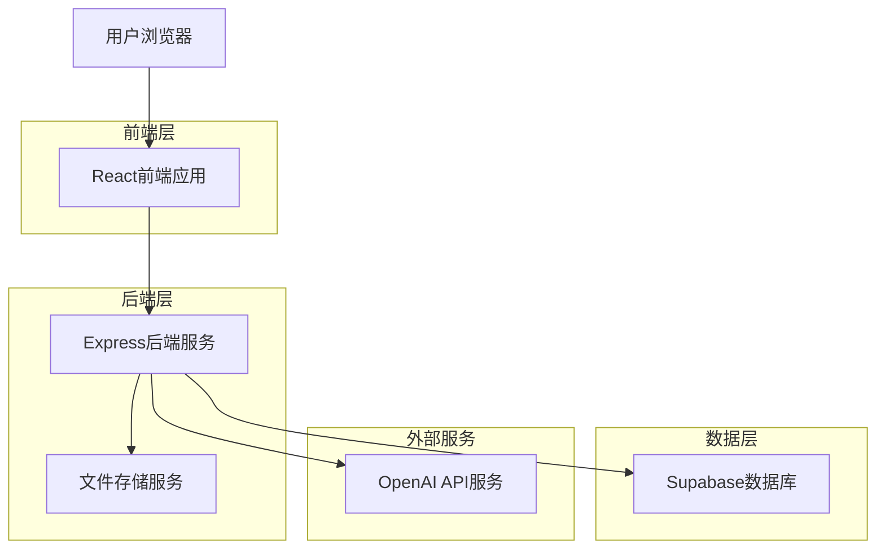
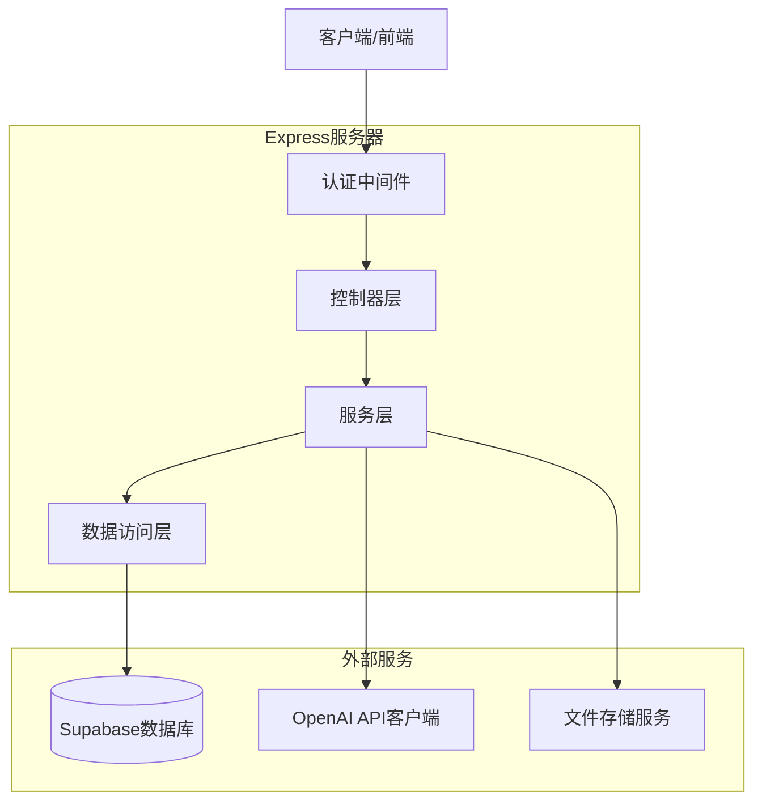
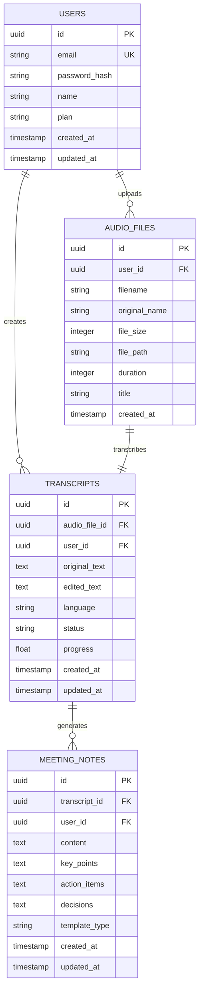

## 1. 架构设计



## 2. 技术描述

* **前端**：React\@18 + TypeScript\@5 + Tailwind CSS\@3 + Vite\@4

* **后端**：Express.js\@4 + Node.js\@18 + Multer\@1 (文件上传)

* **数据库**：Supabase (PostgreSQL\@15)

* **AI服务**：OpenAI API (Whisper语音转文字 + GPT文本处理)

* **文件存储**：Supabase Storage

* **部署**：Vercel (前端) + Railway (后端)

## 3. 路由定义

| 路由              | 用途               |
| --------------- | ---------------- |
| /               | 首页，产品展示和功能入口     |
| /record         | 录音页面，支持实时录音和文件上传 |
| /transcribe/:id | 转写页面，显示转写进度和结果   |
| /editor/:id     | 纪要编辑页面，智能生成和手动编辑 |
| /history        | 历史记录页面，管理所有会议纪要  |
| /export/:id     | 导出页面，选择格式并下载     |
| /profile        | 用户中心，个人信息和订阅管理   |
| /login          | 登录页面，用户认证        |
| /register       | 注册页面，新用户注册       |

## 4. API定义

### 4.1 认证相关API

**用户注册**

```
POST /api/auth/register
```

请求参数：

| 参数名      | 类型     | 必填 | 描述         |
| -------- | ------ | -- | ---------- |
| email    | string | 是  | 用户邮箱地址     |
| password | string | 是  | 用户密码（加密存储） |
| name     | string | 是  | 用户姓名       |

响应参数：

| 参数名     | 类型      | 描述      |
| ------- | ------- | ------- |
| success | boolean | 注册成功状态  |
| token   | string  | JWT认证令牌 |
| user    | object  | 用户信息对象  |

**用户登录**

```
POST /api/auth/login
```

请求参数：

| 参数名      | 类型     | 必填 | 描述     |
| -------- | ------ | -- | ------ |
| email    | string | 是  | 用户邮箱地址 |
| password | string | 是  | 用户密码   |

### 4.2 录音文件管理API

**上传音频文件**

```
POST /api/audio/upload
```

请求参数（FormData）：

| 参数名   | 类型     | 必填 | 描述                  |
| ----- | ------ | -- | ------------------- |
| audio | File   | 是  | 音频文件（支持mp3、wav、m4a） |
| title | string | 否  | 录音标题                |

**获取录音列表**

```
GET /api/audio/list
```

查询参数：

| 参数名   | 类型     | 必填 | 描述        |
| ----- | ------ | -- | --------- |
| page  | number | 否  | 页码，默认1    |
| limit | number | 否  | 每页数量，默认10 |

### 4.3 语音转写API

**开始转写任务**

```
POST /api/transcribe/start
```

请求参数：

| 参数名      | 类型     | 必填 | 描述        |
| -------- | ------ | -- | --------- |
| audioId  | string | 是  | 音频文件ID    |
| language | string | 否  | 语言代码，默认zh |

**获取转写结果**

```
GET /api/transcribe/result/:id
```

**更新转写文本**

```
PUT /api/transcribe/update
```

请求参数：

| 参数名          | 类型     | 必填 | 描述     |
| ------------ | ------ | -- | ------ |
| transcribeId | string | 是  | 转写记录ID |
| text         | string | 是  | 修正后的文本 |

### 4.4 会议纪要API

**生成会议纪要**

```
POST /api/meeting/generate
```

请求参数：

| 参数名          | 类型     | 必填 | 描述     |
| ------------ | ------ | -- | ------ |
| transcribeId | string | 是  | 转写记录ID |
| template     | string | 否  | 纪要模板类型 |

**更新会议纪要**

```
PUT /api/meeting/update
```

**导出会议纪要**

```
POST /api/meeting/export
```

请求参数：

| 参数名       | 类型     | 必填 | 描述                      |
| --------- | ------ | -- | ----------------------- |
| meetingId | string | 是  | 会议纪要ID                  |
| format    | string | 是  | 导出格式（pdf、word、markdown） |

## 5. 服务器架构图



## 6. 数据模型

### 6.1 数据模型定义



### 6.2 数据定义语言

**用户表（users）**

```sql
-- 创建用户表
CREATE TABLE users (
    id UUID PRIMARY KEY DEFAULT gen_random_uuid(),
    email VARCHAR(255) UNIQUE NOT NULL,
    password_hash VARCHAR(255) NOT NULL,
    name VARCHAR(100) NOT NULL,
    plan VARCHAR(20) DEFAULT 'free' CHECK (plan IN ('free', 'premium')),
    created_at TIMESTAMP WITH TIME ZONE DEFAULT NOW(),
    updated_at TIMESTAMP WITH TIME ZONE DEFAULT NOW()
);

-- 创建索引
CREATE INDEX idx_users_email ON users(email);
CREATE INDEX idx_users_plan ON users(plan);
```

**音频文件表（audio\_files）**

```sql
-- 创建音频文件表
CREATE TABLE audio_files (
    id UUID PRIMARY KEY DEFAULT gen_random_uuid(),
    user_id UUID NOT NULL REFERENCES users(id) ON DELETE CASCADE,
    filename VARCHAR(255) NOT NULL,
    original_name VARCHAR(255) NOT NULL,
    file_size INTEGER NOT NULL,
    file_path VARCHAR(500) NOT NULL,
    duration INTEGER DEFAULT 0,
    title VARCHAR(255),
    created_at TIMESTAMP WITH TIME ZONE DEFAULT NOW()
);

-- 创建索引
CREATE INDEX idx_audio_files_user_id ON audio_files(user_id);
CREATE INDEX idx_audio_files_created_at ON audio_files(created_at DESC);
```

**转写记录表（transcripts）**

```sql
-- 创建转写记录表
CREATE TABLE transcripts (
    id UUID PRIMARY KEY DEFAULT gen_random_uuid(),
    audio_file_id UUID NOT NULL REFERENCES audio_files(id) ON DELETE CASCADE,
    user_id UUID NOT NULL REFERENCES users(id) ON DELETE CASCADE,
    original_text TEXT,
    edited_text TEXT,
    language VARCHAR(10) DEFAULT 'zh',
    status VARCHAR(20) DEFAULT 'processing' CHECK (status IN ('processing', 'completed', 'failed')),
    progress FLOAT DEFAULT 0,
    created_at TIMESTAMP WITH TIME ZONE DEFAULT NOW(),
    updated_at TIMESTAMP WITH TIME ZONE DEFAULT NOW()
);

-- 创建索引
CREATE INDEX idx_transcripts_user_id ON transcripts(user_id);
CREATE INDEX idx_transcripts_audio_file_id ON transcripts(audio_file_id);
CREATE INDEX idx_transcripts_status ON transcripts(status);
```

**会议纪要表（meeting\_notes）**

```sql
-- 创建会议纪要表
CREATE TABLE meeting_notes (
    id UUID PRIMARY KEY DEFAULT gen_random_uuid(),
    transcript_id UUID NOT NULL REFERENCES transcripts(id) ON DELETE CASCADE,
    user_id UUID NOT NULL REFERENCES users(id) ON DELETE CASCADE,
    content TEXT NOT NULL,
    key_points TEXT,
    action_items TEXT,
    decisions TEXT,
    template_type VARCHAR(50) DEFAULT 'standard',
    created_at TIMESTAMP WITH TIME ZONE DEFAULT NOW(),
    updated_at TIMESTAMP WITH TIME ZONE DEFAULT NOW()
);

-- 创建索引
CREATE INDEX idx_meeting_notes_user_id ON meeting_notes(user_id);
CREATE INDEX idx_meeting_notes_transcript_id ON meeting_notes(transcript_id);
CREATE INDEX idx_meeting_notes_created_at ON meeting_notes(created_at DESC);
```

**Supabase访问权限设置**

```sql
-- 授予匿名用户基本读取权限
GRANT SELECT ON users TO anon;
GRANT SELECT ON audio_files TO anon;
GRANT SELECT ON transcripts TO anon;
GRANT SELECT ON meeting_notes TO anon;

-- 授予认证用户完整权限
GRANT ALL PRIVILEGES ON users TO authenticated;
GRANT ALL PRIVILEGES ON audio_files TO authenticated;
GRANT ALL PRIVILEGES ON transcripts TO authenticated;
GRANT ALL PRIVILEGES ON meeting_notes TO authenticated;
```

## 7. 技术实现方案

### 7.1 录音功能实现

* **前端**：使用Web Audio API和MediaRecorder实现浏览器录音

* **音频格式**：优先使用WebM格式，回退到WAV格式

* **实时波形**：通过AnalyserNode获取音频数据并绘制波形图

* **文件上传**：使用分片上传技术处理大文件，支持断点续传

### 7.2 语音转文字实现

* **OpenAI Whisper API**：支持多语言识别，准确率高

* **异步处理**：使用队列系统处理转写任务，避免超时

* **进度跟踪**：WebSocket实时推送转写进度

* **说话人识别**：通过声音特征分析实现基础说话人分离

### 7.3 智能纪要生成

* **GPT模型**：使用GPT-3.5-turbo进行文本分析和提取

* **提示工程**：设计专业的提示词模板，确保输出质量

* **结构化提取**：自动识别关键信息、行动项、决策点

* **多语言支持**：支持中英文混合内容的智能分析

### 7.4 导出功能实现

* **PDF导出**：使用Puppeteer生成高质量PDF文件

* **Word导出**：使用docx.js库生成Word文档

* **Markdown导出**：直接输出标准Markdown格式

* **模板系统**：支持自定义导出模板和样式

### 7.5 性能优化

* **前端优化**：代码分割、懒加载、图片压缩、CDN加速

* **后端优化**：数据库索引优化、缓存策略、API响应压缩

* **文件处理**：异步处理大文件，支持后台任务队列

* **存储优化**：音频文件压缩、定期清理临时文件

